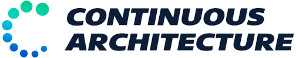

# Continuous Architecture Toolkit



## Purpose

The Continuous Architecture Toolkit offers guiding ideas, practices, rituals, and methods. Unlike most existing enterprise architecture or agile-at-scale frameworks, Continuous Architecture:

- Starts from your real-world problems rather than proposing generic organizational or architectural models.
- Supports the transition from project to product-oriented delivery.
- Leverages the power of modern software engineering practices.
- Is truly open and community-driven.

## Governance

We aim to make contributing to the Continuous Architecture Toolkit a pleasant and enriching experience for everyone, regardless of skill level. Contributions of all kinds are welcome!

Learn more about our [governance model](content/english/pages/governance.md) and how you can get involved.

To get started, please read our [Contribution Guidelines](./contributing.md).

## Supporting Us

We are a collective of passionate architects and open source advocates working to transform the way software architecture is practiced. We occasionally organize physical and virtual events, which may require some funding. Our goal is not to profit but simply to cover expenses.

If you would like to support our efforts, you can do so [here](https://opencollective.com/continuous-architecture-toolkit).  
Thank you :pray:

## Build the Continuous Architecture Website Locally

The [Continuous Architecture Toolkit website](https://continuous-architecture.org) is built with [Hugo](https://gohugo.io), using the [Hugoplate](https://github.com/zeon-studio/hugoplate) template and styled with [Tailwind CSS](https://tailwindcss.com/). You can generate or preview the website locally by following the steps below.

### 1. Prerequisites

Install the following tools based on your operating system:

#### macOS / Linux

```bash
brew install hugo
brew install node
brew install go
```

#### Windows (using Chocolatey)

```powershell
choco install hugo-extended
choco install nodejs
choco install golang
```

> 💡 Make sure you restart your terminal or use an elevated shell after installation.

### 2. Clone the Repository

HTTPS:
```bash
git clone https://github.com/continuous-architecture/toolkit.git
```

SSH:
```bash
git clone git@github.com:continuous-architecture/toolkit.git
```

### 3. Install Dependencies

Run the following command inside the project folder:

```bash
npm install
```

### 4. Build or Serve

- To build the static site in the `/public` folder:
  ```bash
  npm run build
  ```

- To serve locally for development (default: [http://127.0.0.1:1313](http://127.0.0.1:1313)):
  ```bash
  npm run dev
  ```
  Or directly with Hugo:
  ```bash
  hugo server --disableFastRender
  ```

If you're planning to contribute to the website's content or structure, please read the [Contribution Guidelines](./contributing.md) to ensure consistency across the project.

## License

The Continuous Architecture Toolkit is distributed under the [Apache License 2.0](https://www.apache.org/licenses/LICENSE-2.0), except for some illustrations which are shared under the [Creative Commons Attribution-ShareAlike 4.0 International License (CC BY-SA 4.0)](http://creativecommons.org/licenses/by-sa/4.0/).

## Maintainers

The Continuous Architecture Toolkit was initially developed by:

- [Thierry Fraudet](mailto:thierry.fraudet@michelin.com) & [Olivier Jauze](mailto:ojauze@gmail.com) – Michelin  
- [Nicolas Chevalier](mailto:nch.nicolas.chevalier@gmail.com) – Gluendo

They were soon joined by a group of enthusiastic contributors from DXC, Société Générale, France Travail, Thales Group, and others who shared the same vision for evolving architecture in the modern software world.

### Core Contributors

- [Frédéric Lé](mailto:fle@youragileway.com) – youragileway.com  
- [Corentin Moussard](mailto:corentin.moussard@gmail.com) – Graphic Designer  
- [Jérôme Regnier](mailto:jerome.regnier@socgen.com) – Société Générale  
- [Jérémie Grodziski](mailto:jeremie@grodziski.com) – Adixe  
- [Romain Chapon](mailto:romain.chapon@michelin.com) – Michelin  
- [Yoni Boukhobza](mailto:yoni.boukhobza@socgen.com) – Société Générale  
- [Celia Carceller Kemiche](mailto:celia.carceller-kemiche@pole-emploi.fr) – France Travail  
- [François Bivaud](mailto:francois.bivaud@pole-emploi.fr) – France Travail  
- [Gael Herent](mailto:gael.herent@thalesgroup.com) – Thales Group  
- [Olivier Trantoul](mailto:olivier.trantoul@thalesgroup.com) – Thales Group

---

**In memory of Jean-Marc Bunouf**, who sadly passed away before the release of our first MVP. Although he couldn't see the project to its completion, his contributions were invaluable. We are deeply grateful for his input and vision.
